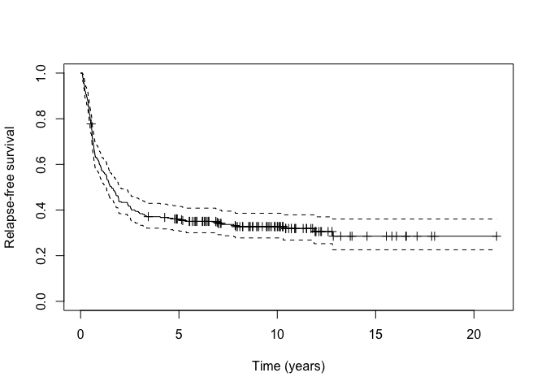
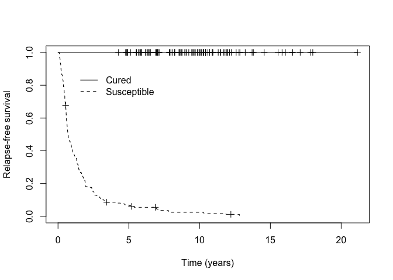
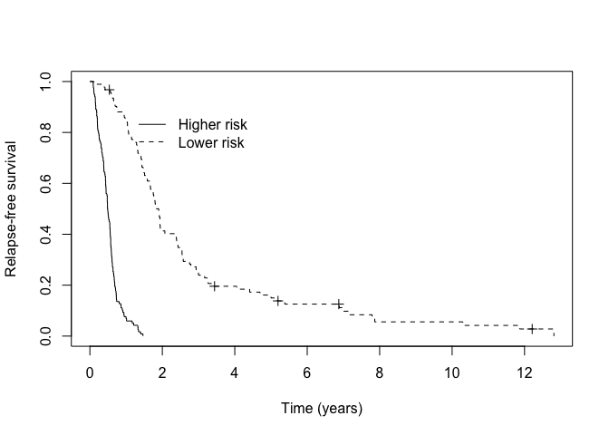

<!-- README.md is generated from README.Rmd. Please edit that file -->

# hdcuremodels

<!-- badges: start -->

[](https://github.com/kelliejarcher/hdcuremodels/actions/workflows/R-CMD-check.yaml)
<!-- badges: end -->

The goal of hdcuremodels is to allow one to fit a penalized mixture cure
model (MCM) when there is a high-dimensional covariate space, such as
when high-throughput genomic data are used in modeling time-to-event
data, when some subjects will not experience the event of interest.
Conventionally, we call the subset of subjects who are immune to the
event of interest cured while all other subjects are susceptible to the
event.

## Installation

You can install the development version of hdcuremodels like so:

``` r
install.packages("hdcuremodels")
```

## Example

After loading the `hdcuremodels` and `survival` packages, load
`amltrain` which includes 306 patients diagnosed with acute myeloid
leukemia (AML) who were cytogenetically normal at diagnosis along with
time-to-event outcomes: `cryr` is the duration of complete response (in
years), `relapse.death` is a censoring variable where 1 indicates the
patient relapsed or died and 0 indicates the patient was alive at last
follow-up. It is of interest to fit a MCM using the expression for 320
transcripts measured using RNA-sequencing as predictor variables.

``` r
library(hdcuremodels)
library(survival)
```

``` r
data(amltrain)
```

We can inspect the Kaplan-Meier survival curve to determine whether a
cure fraction seems to be present.

``` r
km_train <- survfit(Surv(cryr, relapse.death) ~ 1, data = amltrain)
```



As can be seen from the Kaplan-Meier plot, there is a long-plateau that
does not drop down to zero. This may indicate the presence of a cured
fraction. We can test the null hypothesis that the cured fraction is
zero against the alternative hypothesis that the cured fraction is not
zero using the `nonzerocure_test` function.

``` r
nonzerocure_test(km_train)
#> $proportion_susceptible
#> [1] 0.7146919
#> 
#> $proportion_cured
#> [1] 0.2853081
#> 
#> $p_value
#> [1] "< 0.001"
#> 
#> $time_95_percent_of_events
#> [1] 5.294299
```

Given the small p-value we reject the null hypothesis and conclude there
is a non-zero cure fraction present. We can also extract the cured
fraction as the Kaplan-Meier estimate beyond the last observed event
using the `cure_estimate` function.

``` r
cure_estimate(km_train)
#> [1] 0.2853081
```

We now fit a penalized MCM using the E-M algorithm where the penalty
parameters for incidence and latency, `lambda.inc` and `lambda.lat` were
previously determined using cross-validation.

``` r
fitem <- cureem(Surv(cryr, relapse.death) ~ .,
  data = amltrain,
  x_latency = amltrain, model = "cox",
  lambda_inc = 0.009993, lambda_lat = 0.02655
)
```

Coefficient estimates can be extracted from the fitted model using the
`coef` for any of these model criteria (“logLik”, “AIC”, “cAIC”, “mAIC”,
“BIC”, “mBIC”, “EBIC”) or by specifying the step at which the model is
desired by specifying the `model_select` parameter. For example,

``` r
coef_cAIC <- coef(fitem, model_select = "cAIC")
```

Predictions can be extracted at a given step or information criterion
(“logLik”, “AIC”, “cAIC”, “mAIC”, “BIC”, “mBIC”, “EBIC”) using the
`predict` function with `model_select` specified.

``` r
train_predict <- predict(fitem, model_select = "cAIC")
```

This returns three objects: `p_uncured` is the estimated probability of
being susceptible ($\hat{p}(\mathbf{x})$), `linear_latency` is
$\hat{\boldsymbol{\beta}}\mathbf{w}$, while `latency_risk` applies high
risk and low risk labels using zero as the cutpoint from the
`linear_latency` vector. Perhaps we want to apply the 0.5 threshold to
`p_uncured` to create Cured and Susceptible labels.

``` r
p_group <- ifelse(train_predict$p_uncured < 0.50, "Cured", "Susceptible")
```

Then we can assess how well our MCM identified patients likely to be
cured from those likely to be susceptible visually by examining the
Kaplan-Meier curves.

``` r
km_cured <- survfit(Surv(cryr, relapse.death) ~ p_group, data = amltrain)
```



We can assess how well our MCM identified higher versus lower risk
patients among those predicted to be susceptible visually by examining
the Kaplan-Meier curves.

``` r
km_suscept <- survfit(Surv(cryr, relapse.death) ~ train_predict$latency_risk, data = amltrain, subset = (p_group == "Susceptible"))
```



Of course, we expect our model to perform well on our training data. We
can also assess how well our fitted MCM performs using the independent
test set `amltest`. In this case we use the `predict` function with
`newdata` specified.

``` r
test_predict <- predict(fitem, newdata = amltest, model_select = "cAIC")
```
